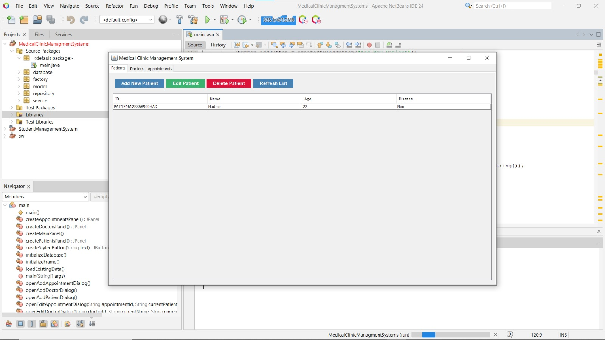
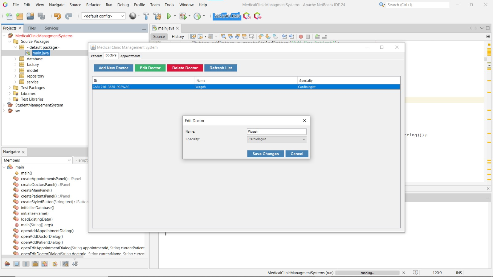
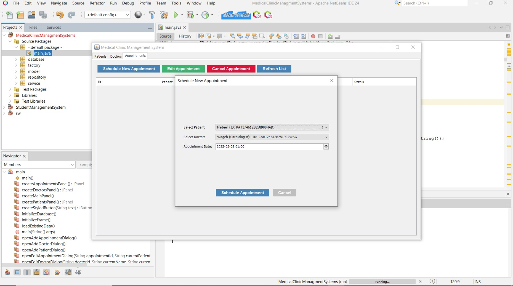

# 👩‍⚕️ Medical Clinic Management System 💗

## ✨ Welcome to My Project! 
Hi there! I'm excited to share with you my Medical Clinic Management System. This lovely project helps manage our medical clinic with style and efficiency! Built with Java and a beautiful Swing GUI interface in NetBeans IDE. Let's make healthcare management more beautiful and organized together! 🌸

## 📸 System Screenshots
Here are some screenshots of our beautiful system interface:


*Main interface of the Medical Clinic Management System*


*Patient Management Interface*


*Appointment Scheduling Screen*

## 🎀 Development Environment

### 💫 What You'll Need
- NetBeans IDE 8.2 or higher ✨
- Java Development Kit (JDK) 8 or higher 💝
- MySQL Server (for our database needs) 💖

### 🌺 Setting up Your Project in NetBeans
1. Open NetBeans IDE 
2. Go to File -> Open Project (like opening a gift! 🎁)
3. Find your project folder
4. Click Open Project and watch the magic happen! ✨

### 🎀 Our Beautiful Project Structure
```
Medical Clinic Management System
├── 📁 Source Packages
│   └── src
│       ├── 📄 main.java           # Where everything begins!
│       ├── 📁 model/             # Our data models
│       ├── 📁 factory/           # Creating objects with care
│       ├── 📁 service/           # Heart of our system
│       ├── 📁 repository/        # Data management
│       └── 📁 database/          # Database magic
├── 📚 Libraries                  # Our helpful tools
├── 🔍 Test Packages             # Making sure everything's perfect
└── 📋 Project Files
    ├── build.xml
    └── manifest.mf
```

## 💝 Features That Make Us Special

### 👩‍⚕️ Patient Care
- Welcome new patients with warmth
- Keep their information safe and organized
- Update their details with care
- Maintain their records with love

### 👨‍⚕️ Doctor Management
- Add amazing doctors to our team
- Keep track of their specialties
- Update their information easily
- Manage their schedules with grace

### 📅 Appointment Scheduling
- Book appointments with a smile
- Make changes when needed
- Send gentle reminders
- Keep everything organized

### 📋 Medical Records
- Keep everything neat and tidy
- Store information safely
- Access records easily
- Maintain privacy always

## 🎨 Our Beautiful Interface
- Designed with love using Java Swing
- Easy to use and pretty to look at
- Organized tabs for everything
- Responsive and friendly design

## 💎 Technical Details (But Make It Pretty!)

### 🌺 What Makes Us Work
- Java SE Development Kit (our foundation)
- Swing GUI Framework (making things beautiful)
- JDBC for database connections (keeping everything together)

### 🎀 Database Organization
We keep track of:
- 👥 Patients
- 👨‍⚕️ Doctors
- 📅 Appointments
- 📋 Medical Records
- 🔬 Lab Results

## 🔐 Keeping Everything Safe
- Careful validation of all information
- Secure database operations
- Graceful error handling
- Detailed activity logging

## 🌟 Future Dreams
1. Even better appointment scheduling
2. Connecting with other medical systems
3. Beautiful reports and analytics
4. Mobile app development
5. Electronic prescriptions

## 👩‍💻 About the Creator
Created with love by [@hadeerw](https://github.com/hadeerw) 💕

## 🎀 Getting Started

### 💫 Setting Everything Up
1. Make sure you have Java JDK 11 or higher installed
2. Get Apache Ant ready for building

### 💝 If You Need Help
If you have any database connection issues:
1. Check that your `lib` folder has the SQLite JDBC driver
2. The `clinic.db` file will appear automatically
3. Watch for helpful messages in the console

## 🌸 Special Tips for NetBeans Users
1. Use Navigator (Ctrl+7) to find your way around
2. Projects window (Ctrl+1) keeps everything organized
3. Files window (Ctrl+2) shows you all the details
4. Services window (Ctrl+5) helps manage your database

### 💫 Forms and Design
- Beautiful forms created with NetBeans Form Editor
- Custom dialogs that look amazing
- Everything stored neatly with .form files

### 🎀 Database Connection
- Easy database management
- Simple connection settings
- Clear database visualization

### ✨ Project Setup
- Everything configured just right
- Dependencies managed neatly
- Perfect Java 8 compatibility

### 💖 Debugging Made Easy
- Built-in helper tools
- Easy problem solving
- Step-by-step guidance
- Clear variable tracking
